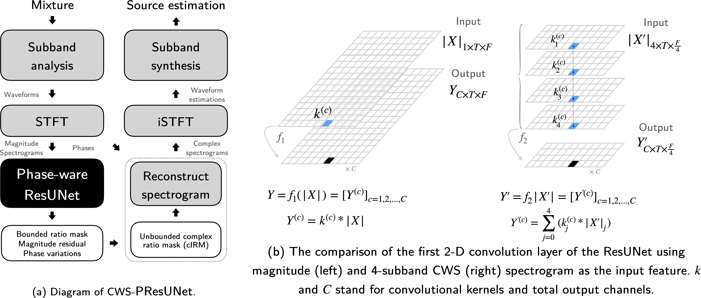

# Abstract	

Music source separation (MSS) has shown tremendous success with deep learning models. Many MSS models perform separations on spectrogram by estimating bounded ratio masks and reusing the phase of mixture. If the model is convolutional neural network (CNN) based, weights are usually shared in each channel during convolution, regardless of the dissimilar patterns between frequency bands. In this study, we proposed a new model, channel-wise subband phase-aware ResUNet (CWS-PResUNet), which estimates unbound mask and phase variations in subbands for separations. CWS-PResUNet utilizes channel-wise subband (CWS) feature to limit unnecessary global weight sharing on spectrogram and reduce computational resource consumptions. The resource saved by CWS can in turn allow for a larger architecture. On MUSDB18HQ test set, a 276-layer CWS-PResUNet achieves state-of-the-art performance on *vocals* with a 8.92 SDR score. Based on CWS-PResUNet and Demucs, our ByteMSS system^[https://github.com/haoheliu/2021-ISMIR-MSS-Challenge-CWS-PResUNet] ranks 2nd on *vocals* score and 5th on average score in 2021 ISMIR Music Demixing Challenge limited training data track (leaderboard A).

# Method

{ width=100% }

**ByteMSS** is our system submitted for the MDX Challenge[@mitsufuji2021music]. we setup a 276-layer CWS-ResUNet to separate `vocals` track, a 166-layer CWS-PResUNet for `other` track, and the open-sourced demucs[@defossez2019demucs] for `bass` and `drums` tracks. 

**CWS-PResUNet** is a ResUNet[@zhang2018road;@liu2021voicefixer] based model integrating CWS feature [@liu2020channel] and the complex ideal ratio mask (cIRM) estimation strategies described in [@kong2021decoupling]. The overall pipline is summerized in Figure 1a. CWS-PResUNet contains a down-sampling and a up-sampling path with skip connections between the same level. As shown in Figure 1b, the CWS feature can make the CNN featuremaps smaller and save computational resources. Also, CNN will have separate weights in each channel by using CWS feature, in which case model becomes more efficient by diverging subband information into channels and enlarging receptive fields. Moreover, because bounded mask and mixture phase can limit the theoretical upper bound of MSS system [@kong2021decoupling], we estimate unbounded mask and phase variations in each subband to compute the unbounded cIRM. 

Normally source-dedicated model only need to predict one source. For example, our `vocals` model calculate L1 loss between the target and estimation `vocals`. But for `other` track, we notice estimating and optimizing four sources together can result in a 0.2 SDR gain. So, in this case, we calculate both L1 loss and energy conservation loss across four sources to optimize our model.

**Demucs** is a model that perform separation in the time domain. In our study we adopted the open-sourced pretrained demucs^[https://github.com/facebookresearch/demucs] and do not apply the shift trick because it will make the inference speed slower.

# Experiments

Models are optimized using the training part of MUSDB18HQ[@rafii2019musdb18]. We use Adam optimizer with learning-rate warmup and exponential decay tricks. CWS-PResUNet takes approximately five days to train on a Tesla V100 GPU. We use a 10-second long `boxcar` windowing function with no overlapping to segment signal during inference. The evaluation is performed on MUSDB18HQ test set with the open-sourced tool *museval*[@SiSEC18]. 

<!-- We suppose freqeuncy domain model is more powerful on modeling complex harmonic patterns and time domain model is better for purcussive and band-limited patterns.  -->

The following table lists the results of the baselines and our proposed system. Evaluation  shows our CWS-PResUNets achieve a SDR of 8.92 and 5.84 on `vocals` and `other` sources, respectively, outperforming baseline system X-UMX[@x-umx-sawata2021all], D3Net[@takahashi2020d3net], and Demucs by a large margin. The SDR of the `other` model will decrease to 5.62 if not trained with four sources. The open-sourced demucs perform better than CWS-PResUNet on `bass` and `drums` and we integrate demucs directly in ByteMSS. 

|    Models    | Vocals | Drums |  Bass | Other | Average |
|:------------:|:------:|:-----:|:-----:|:-----:|:-------:|
|     X-UMX    |  6.61  |  6.47  | 5.43  | 4.64  |  5.79  |
|     D3Net    |  7.24  |  7.01 |  5.25 |  4.53 |  6.01   |
|    Demucs    |  6.89  | **6.57**  | **6.53**  | 5.14  |  6.28   |
| CWS-PResUNet |  **8.92**  | 6.38  | 5.93  | **5.84**  |  6.77   |
|    ByteMSS   |  8.92  | 6.57  | 6.53  | 5.84  |  **6.97**   |

# Reference